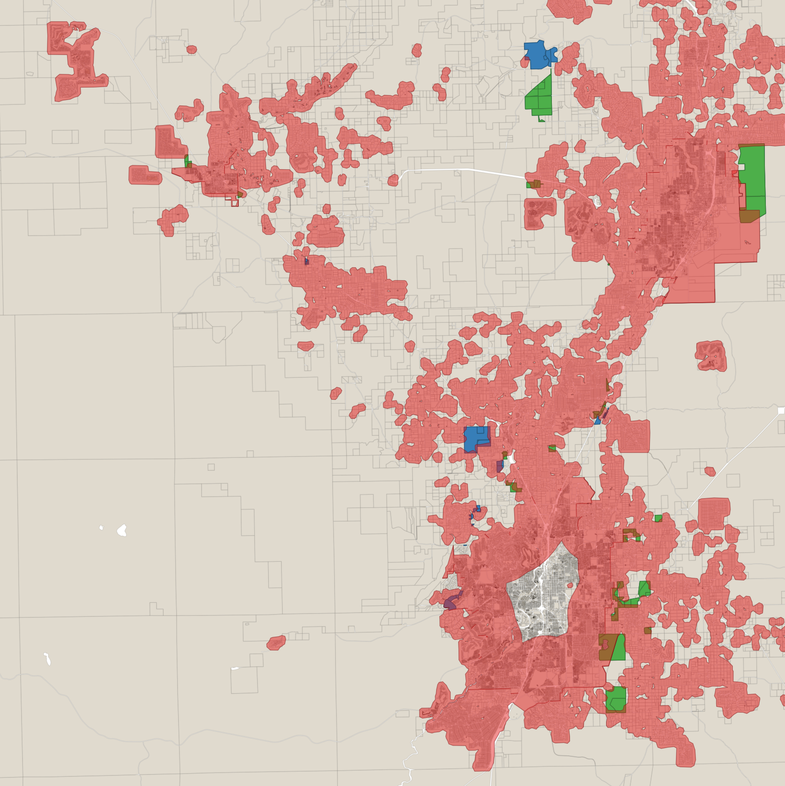

# DeColanduse

An S2S analysis of zoning and land use trends in Deschutes County, Oregon

## Objectives

In this analysis, we combined several GIS layers and other publicly available data to answer several questions:

* How much "spot zoning" has occured in the County? "Spot zoning" is defined as a comprehensive plan amendment and zoning change that results in the conversion of land zoned for Exclusive Farm Use (EFU), Forest Use (F1/F2), or Surface Mining (SM) to Rural Residential (RR-10), a Rural Residential Exception Area (RREA), Multiple Use Agricultural (MUA-10) or, when resulting in low-density development inconsistent with the state's land use planning goals, to Rural Industrial (RI). Deschutes County base zones are [defined here](https://www.deschutes.org/cd/page/efu-f1-mua10-rc-ri-rr10-uar10-base-zones) on the County website. For purposes of this analysis, zoning changes required for the annexation of land into a city's Urban Growth Boundary under Oregon's [comprehensive land use planning system](https://www.oregon.gov/lcd/OP/Pages/index.aspx) are *not* considered "spot zoning" as these zoning changes are presumed to be consistent with the state's land use planning goals. 

* How much of this "spot zoning" development has taken place in areas at high risk for forest fires? We use several different definitions to capture this risk, including whether the zoning change occured within the wildland-urban interface (WUI) zone.

## Data sources and subsetting

* **Comprehensive plan amendment and zoning change data from the Deschutes County Community Development Department:** We downloaded the available data for all land use permit applications submitted to the county between January 1, 2004, to September 22, 2025, using the county's [permit query tool](https://www.deschutes.org/cd/page/permit-query). These data are saved as a Microsoft Excel file named [landusepermits_2004-2025.xlsx](data/raw/landusepermits_2004-2025.xlsx).

	* **Subsetting:** We then subsetted this dataset to only those approved and pending applications which met our definition of "spot zoning" (i.e., those resulting in zoning changes from EFU, F1/F2 or SM to RR-10, a RREA, MUA-10 or, when resulting in low-density development inconsistent with the state's land use planning goals, to RI). We created two subsets: [landusepermits_SpotZoned.csv](data/derived/landusepermits_SpotZoned.csv), which contains data for all applications, and [landusepermits_SpotZoned_noSM.csv](data/derived/landusepermits_SpotZoned_noSM.csv), which excludes those applications involving land previously zoned for surface mining.
	* **Applications lacking details:** For applications where the proposed zoning change was not immediately discernible from the county's permit query data, we downloaded and reviewed the applicable application and/or approval documents (saved, and then stored [here](data/raw/permitdata/)).   

* **Deschutes County tax lot data**: We downloaded a GIS layer containing county tax lot data from [https://hub.arcgis.com/maps/901cdd4a5ca24cc3b72cc8e3e0f11f02/about](https://hub.arcgis.com/maps/901cdd4a5ca24cc3b72cc8e3e0f11f02/about). This layer is saved as [Taxlots_5538463434383085955](data/raw/Taxlots_5538463434383085955).

* **Wildfire risk**: We downloaded several different datasets that contained estimates of wildfire risk:

	* **Wildland-urban interface (WUI) boundary**: We downloaded [this GIS layer](https://www.arcgis.com/home/item.html?id=3e9936d176444a1a92dbff96666966ca), which contains the WUI boundary defined under the [now-repealed](https://www.opb.org/article/2025/06/25/oregon-legislature-repeals-contested-wildfire-hazard-map/) SB 762/SB 80 State Wildfire Hazard Map. This layer is [saved here](data/raw/Oregon_Wildland_Urban_Interface_-3583271597336644341).

	* **Deschutes County "Zoning Wildfire Hazard"** layer: Downloaded from the [Deschutes County GIS portal](https://data.deschutes.org/maps/fa2c92b4b043482896c0f6f7cf23a146) and saved [here](data/raw/Zoning_Wildfire_Hazard_-3634365223684073301).

	* **Oregon CWPP risk data**: We also downloaded two Oregon CWPP datasets containing other measures of risk: [Integrated Wildfire Risk (Expected and Conditional)](https://oe.oregonexplorer.info/externalcontent/wildfire/data/PNW_QWRA_Integrated_Wildfire_Risk_2023.zip) and [Risk to People and Property](https://oe.oregonexplorer.info/externalcontent/wildfire/data/PNW_QWRA_Risk_to_People_and_Property_2023.zip). These files are not saved with this project since they're too large ( > 5 GB in each case). 

* **Other input data**:

	* **City limits**: Downloaded from the [Deschutes County GIS portal](https://data.deschutes.org) and saved [here](data/raw/City_Limits_2871736090226726764).

	* **Public land**: Downloaded from the [Deschutes County GIS portal](https://data.deschutes.org) and saved [here](data/raw/Public_Lands_8302678428774745135).

## Analysis

* **Spot-zoned taxlots**: Using open source software (QGIS), we created two shapefiles containing taxlots for which spot zoning changes have been approved or are pending: [all_SpotZoned](data/derived/all_SpotZoned) is a layer containing all taxlots; [all_SpotZoned_noSM](data/derived/all_SpotZoned_noSM) is the same layer, but excluding those taxlots with an existing "SM" (Surface Mining) zone code. We created these shapefiles by joining the previously subsetted permit data to the Deschutes County tax lot layer, indexing on the taxlot ID. Findings (also available in table form [in this Excel spreadsheet](data/results/Wildfire_risk_analysis_results.xlsx)):

	* Using the more expansive dataset (i.e., including conversions from "SM"), we identified **32** unique pending or approved permit applications that met our definition of spot zoning, affecting **87** different tax lots that accounted for **5,134 acres** within the County. This included some permit applications for changes in zoning to public land. 

	* Using the more restrictive dataset (i.e., excluding conversions from "SM"), we identified **26** unique pending or approved permit applications that met our definition of spot zoning, affecting **66** different tax lots that accounted for **4,386 acres** within the County. This included some permit applications for changes in zoning to public land.

* **Wildfire risk**: We then interrogated the spot-zoned taxlot data to assess what fraction of approved or pending applications for comprehensive plan amendments and zoning changes were in areas of high wildfire risk. We performed our analysis in each case using the QGIS "Overlap analysis" tool. In our initial analysis, we used two different definitions of risk: the SB 762/SB 80 WUI boundary, and then Deschutes County "Zoning Wildfire Hazard" layer. *We did not use the Oregon CWPP definitions in our initial analysis due to some difficulty opening and working with the .gdb files.*

	* **Summary of findings**: Spot zoning enhances our community's collective exposure to risk from wildfire. Some specific findings:

		* Using either definition of risk, or either definition of spot zoning (i.e., with or without taxlots with an "SM" zone code), **80-84% of applications for spot zoning included one or more taxlots in a wildfire risk zone**.
		* Since 2004, spot zoning has resulted in development of **1300-1400 acres** of county land within the SB 762/SB 80 WUI boundary; if the county's own definition of wildfire hazard risk is used, that number jumps to between **3687-4385 acres** subject to development within a wildfire hazard area.
		* Roughly **one-third (27-29%) of all the land included in spot zoning applications since 2004 falls within the SB 762/SB 80 WUI boundary**. In the case of at least 11 individual spot zoning applications, **the entire project — 100% of the land — fell within the WUI boundary**.

	* **Full results:** See the second tab of [this Excel file](data/results/Wildfire_risk_analysis_results.xlsx) for full results in table format. Two basic plots are show below:

	

	**Figure 1.** All pending and approved spot zoning applications in Deschutes County, 2004-2025. Green color: Taxlots converted from EFU or F1/F2 (exclusive farm or forest use) to RR-10, a RREA, MUA-10 or RI. Blue color: Taxlots converted from SM (surface mining use) to RR-10, a RREA, MUA-10 or RI. Red shading indicates extent of wildland-urban interface (WUI) zone according to the SB 762/SB 80 WUI definition. Basemap shows county tax lots. Between 1300-1400 acres of land approved or pending conversion through spot zoning falls within the red WUI zone.

	

	**Figure 2.** All pending and approved spot zoning applications in Deschutes County, 2004-2025. Green color: Taxlots converted from EFU or F1/F2 (exclusive farm or forest use) to RR-10, a RREA, MUA-10 or RI. Blue color: Taxlots converted from SM (surface mining use) to RR-10, a RREA, MUA-10 or RI. Orange shading indicates extent of Deschutes County's own "Zoning Wildfire Hazard" area. Basemap shows county tax lots. Between 3687-4385 acres of land approved or pending conversion through spot zoning falls within the orange wildfire hazard zone.

